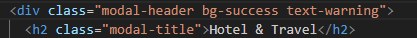
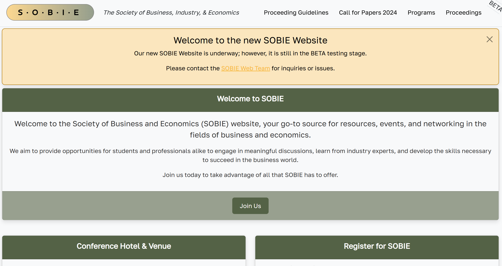

# sobieproductdeploy
# SOBIE product deployment
by Kalani Sorensen, Sam Maldonado, Mandy McGinnis & Isabelle Rushing 

We worked on the front-end components of the SOBIE project, focusing on building a visually appealing and functional user interface. While we made significant progress in implementing the core structure of the webpage, we encountered challenges when it came to designing its overall look and feel.
# Project Problem

We attempted to use Bootstrap to enhance the design of the SOBIE project webpage. While Bootstrap initially seemed like a convenient framework for quickly styling components and creating a responsive layout, we soon realized its limitations. Customizing Bootstrap’s predefined styles to align with our specific design vision proved to be both restrictive and time-consuming. As a solution, we decided to write our own CSS file, allowing us to work freely without the limitations of predefined frameworks. This approach gave us the flexibility to create a design that fully aligned with our vision.

# Bootstrap design


|  |  | 
|-------------------------|-------------------------|

# Bootstrap Code
<div style="text-align: center;">
    
</div>
<div style="text-align: center;">
    
</div>

# Solution using CSS

|  |  | 
|-------------------------|-------------------------|

|  |  |
|-------------------------|-------------------------|


|-------------------------|-------------------------|


# Message for future developers
### 1. Include the CSS File
- import the css file into your project using code --------> ``` <link rel="stylesheet" href="styles/read.css"> ```
- this should be located in your ```<head>``` section
### 2. Apply classes
- The CSS file defines specific classes for various elements. Use these classes in your HTML to ensure the desired styling is applied.
- ```<div class = "registrant-page">``` this is a class
### 3. Add customization
- ```
  .registrant-page {
    font-family: Arial, sans-serif;
    background-color: #f4f4f9;
    color: #333;
    margin: 0;
    padding: 20px;
  }
  ```
# Pull Requests
- [Pull Request #132](https://github.com/barrycumbie/sobieconference.org/pull/132)
# Branches/Code
- [Branch iss138real](https://github.com/barrycumbie/sobieconference.org/tree/iss138real)
- [Branch iss87](https://github.com/barrycumbie/sobieconference.org/tree/iss87)
